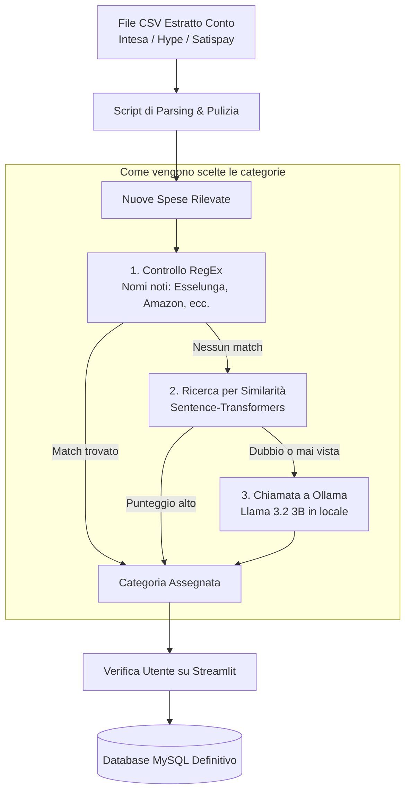

# Personal Finance Tracker con AI Locale

Applicazione web in Python per gestire e analizzare le spese personali partendo dagli estratti conto bancari in formato CSV.

L'obiettivo del progetto è unificare le spese di conti diversi (es. Intesa Sanpaolo, Hype, Satispay) in un unico database con categorizzazione automatica. Il sistema usa un meccanismo a cascata: prima prova con regole fisse via espressioni regolari, poi cerca similarità semantica con le transazioni passate tramite vettori e, solo se serve, interroga un modello LLM in locale su Ollama per dedurre la categoria corretta.

## Anteprima


## Come Funziona il Progetto



### Tecnologie e Librerie

* **Interfaccia Web**: Streamlit (suddivisa in più pagine per caricare i file, vedere le tabelle e consultare i grafici)

* **Grafici**: Altair (per grafici a torta e andamento nel tempo delle spese)

* **Elaborazione Dati**: Pandas (per leggere i CSV, formattare le date italiane e convertire gli importi)

* **Database**: MySQL gestito tramite SQLAlchemy

* **Embeddings & Vettori**: `sentence-transformers` con il modello `paraphrase-multilingual-MiniLM-L12-v2`

* **Modello Locale**: Ollama con `llama3.2:3b` per l'inferenza offline, con output JSON

* **Test**: Pytest

## Caratteristiche Principali

### 1. Importazione dei CSV e Gestione Duplicati

* **Supporto multi-banca**: Ogni banca esporta i file con formati diversi (separatori `;` o `,`, codifiche differenti, nomi delle colonne diversi). Il programma riconosce la struttura del file e normalizza i dati.

* **Evitare i doppioni**: A ogni riga viene associato un hash univoco (SHA-256) calcolato su data, importo e descrizione. Se si ricarica lo stesso estratto conto, le righe già presenti vengono scartate automaticamente.

* **Filtro giroconti**: I bonifici interni e le ricariche tra i propri conti vengono contrassegnati per non conteggiarli due volte nel totale di entrate e uscite.

### 2. Logica di Assegnazione delle Categorie

Invece di mandare ogni spesa all'LLM il sistema usa tre passaggi:

1. **RegEx**: Se la causale contiene parole chiave evidenti (*Netflix*, *Coop*...), la categoria viene assegnata all'istante senza usare AI.

2. **Confronto vettoriale**: Converte la descrizione in un vettore numerico e calcola la similarità del coseno con le spese già approvate nel database. Se la somiglianza supera la soglia di 0.85, prende direttamente quella categoria, altrimenti passa allo step successivo. Nel caricamento vettoriale prima di calcolare l'embedding nuovo vengono rimosse le stopword bacarie dalla descrizione (es. pagamento, pos, SEPA, bonifico...) poiché eccessivo rumore aumenterebbe la vicinanza vettoriale anche tra transazioni di categorie molto diverse.

3. **LLM via Ollama**: Se la somiglianza è bassa o il testo è ambiguo, invia la descrizione a Llama 3.2 chiedendogli di scegliere la categoria più coerente tra quelle disponibili, restituendo un JSON con motivazione e livello di sicurezza.

### 3. Mascheramento Dati Personali

Prima di passare qualsiasi testo al modello locale o salvare le descrizioni nei vettori, un modulo basato su espressioni regolari cerca e rimuove:

* Codici IBAN

* Numeri di carte di pagamento

* Codici Fiscali

* Nomi e cognomi di persone fisiche

### 4. Revisione Manuale

Tutte le transazioni analizzate via LLM compaiono in una tabella interattiva su Streamlit. L'utente può filtrare per livello di confidenza, modificare a mano le categorie sbagliate e salvare le modifiche definitive nel database.

## Test Automatici

La cartella `tests/` contiene 50 test unitari scritti con `pytest` per verificare che parsing, espressioni regolari e connessioni al database funzionino senza errori:

```
pytest -v


```

Per i componenti che richiederebbero Ollama o un server MySQL attivo sono stati usati dei mock (`unittest.mock`), così i test possono girare velocemente anche in locale o senza servizi accesi in background.

## ⚠️ Limiti Noti

* **Transazioni identiche nello stesso giorno**:  
Attualmente l'algoritmo di deduplicazione genera l'hash univoco SHA-256 basandosi sulla tupla `(Data, Importo, Causale)`. Se nello stesso giorno vengono effettuate due transazioni distinte con importo e causale identici, la seconda operazione viene erroneamente scartata come duplicato in quanto gli estratti conto delle banche non forniscono il timestamp della transazione.

## Come Eseguire il Progetto

### Requisiti

* Python 3.11 o superiore

* MySQL (o SQLite configurabile nel file di connessione)

* [Ollama](https://ollama.com/?utm_source=gemini) installato sul computer

### 1. Installazione

```
# Clona la repository
git clone https://github.com/FedericoSburlati/personal-finance-tracker.git
cd personal-finance-tracker

# Crea e attiva l'ambiente virtuale
python -m venv .venv
# Su Windows:
.\.venv\Scripts\activate
# Su Linux/macOS:
source .venv/bin/activate

# Installa le dipendenze
pip install -r requirements.txt


```

### 2. Configurazione Database e Modello

Crea un file chiamato `.env` nella cartella principale con i parametri del tuo database:

```
DB_HOST=localhost
DB_PORT=3306
DB_USER=root
DB_PASSWORD=la_tua_password
DB_NAME=personal_finance


```

Scarica il modello leggero tramite Ollama (servono circa 2 GB di spazio):

```
ollama pull llama3.2:3b


```

### 3. Avvio

```
streamlit run Home.py


```

## Struttura della Repository

```
personal-finance-tracker/
├── assets/                  # Immagini per il README
├── data/                    # CSV di esempio per testare il caricamento
├── pages/                   # Le schermate dell'app Streamlit
│   ├── 1_Transactions.py    # Tabella movimenti e filtri
│   ├── 2_Upload_CSV.py      # Caricamento ed elaborazione file
│   └── 3_Categorization.py  # Controllo categorie e chiamate AI
├── src/
│   ├── core/                # Moduli per RegEx, Ollama e vettori
│   ├── database/            # Connessione e modelli delle tabelle
│   └── etl/                 # Logica di lettura e pulizia dei file CSV
├── tests/                   # File di test con Pytest
├── Home.py                  # Schermata principale
└── requirements.txt         # Pacchetti Python necessari


```
